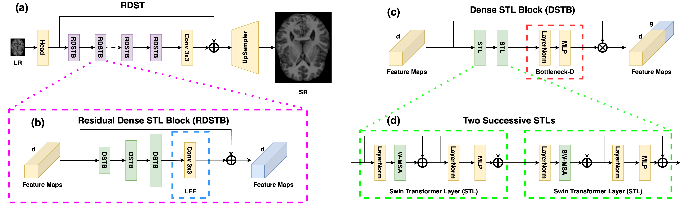
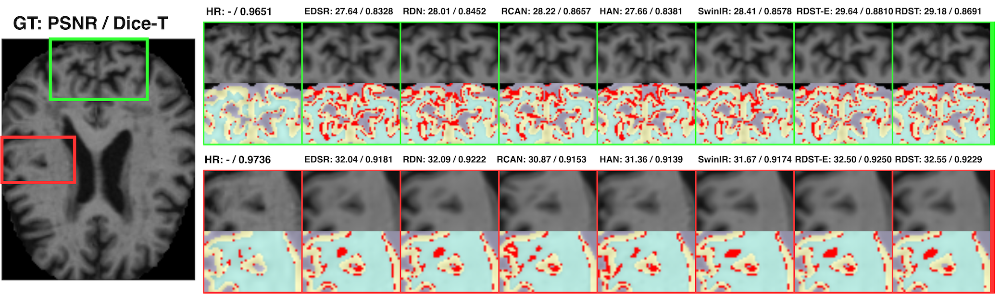
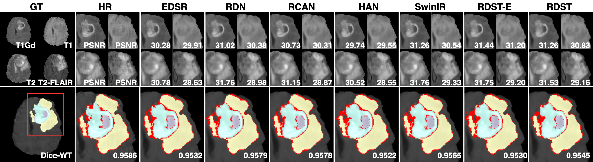
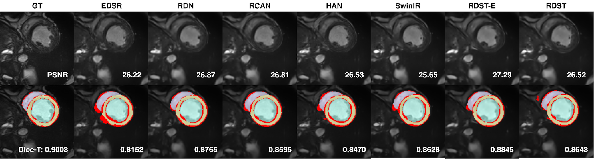
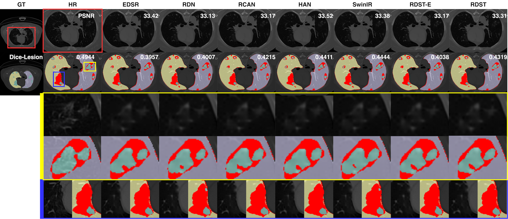
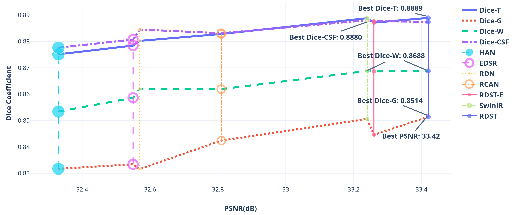
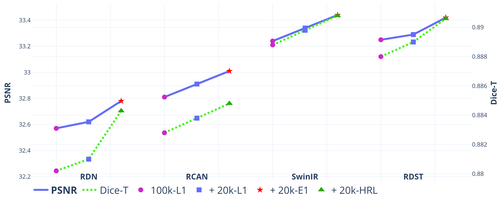

# RDST
A residual dense vision transformer for medical image super-resolution with novel general-purpose perceptual loss.
## Intro
This paper proposes an efficient vision transformer with residual dense connections and local feature fusion to achieve efficient single-image super-resolution (SISR) of medical modalities. Moreover, we implement a general-purpose perceptual loss with manual control for image quality improvements of desired aspects by incorporating prior knowledge of medical image segmentation. Compared with state-of-the-art methods on four public medical image datasets, the proposed method achieves the best PSNR scores of 6 modalities among seven modalities. It leads to an average improvement of +0.09 dB PSNR with only 38\% parameters of SwinIR. On the other hand, the segmentation-based perceptual loss increases +0.14 dB PSNR on average for SOTA methods, including CNNs and vision transformers. Additionally, we conduct comprehensive ablation studies to discuss potential factors for the superior performance of vision transformers over CNNs and the impacts of network and loss function components.


> Framework of the proposed RDST network.

## Results
### Broad applicability on medical images
[OASIS](https://www.oasis-brains.org/)

[BraTS](https://www.med.upenn.edu/cbica/brats2020/data.html)

[ACDC](https://www.creatis.insa-lyon.fr/Challenge/acdc/databases.html)

[COVID-CT](https://zenodo.org/record/3757476)

### Comparing with SOTA methods (PSNR + Segmentation)

### Segmentation-based perceptual loss



# Train & Test
To setup:
```bash
git clone https://github.com/GinZhu/RDST.git
cd RDST
pip install -r requirements.txt
```
To train:
```bash
python -W ignore train.py --config-file config_files/RDST_E1_OASIS_example_SRx4.ini
```
To test:
```bash
python -W ignore test.py --config-file config_files/RDST_E1_OASIS_example_SRx4_testing.ini
```

# Publications & citations
This work is available at [arXiv](https://arxiv.org/abs/2302.11184), please cite as:
```
@article{zhu2023rdst,
  title={A residual dense vision transformer for medical image super-resolution with segmentation-based perceptual loss fine-tuning},
  author={Zhu, Jin and Yang, Guang and Lio, Pietro},
  journal={arXiv preprint arXiv:2302.11184},
  year={2023}
}
```
We refer to the previous works for better understanding of this project:
- Lesion focused multi-scale GAN: [paper1](https://arxiv.org/abs/1810.06693), [paper2](https://arxiv.org/abs/1901.03419), [code](https://github.com/GinZhu/msgan)
- Meta-learning with GAN for scale-free SR: [paper](https://arxiv.org/abs/2105.10738), [code](https://github.com/GinZhu/MIASSR)